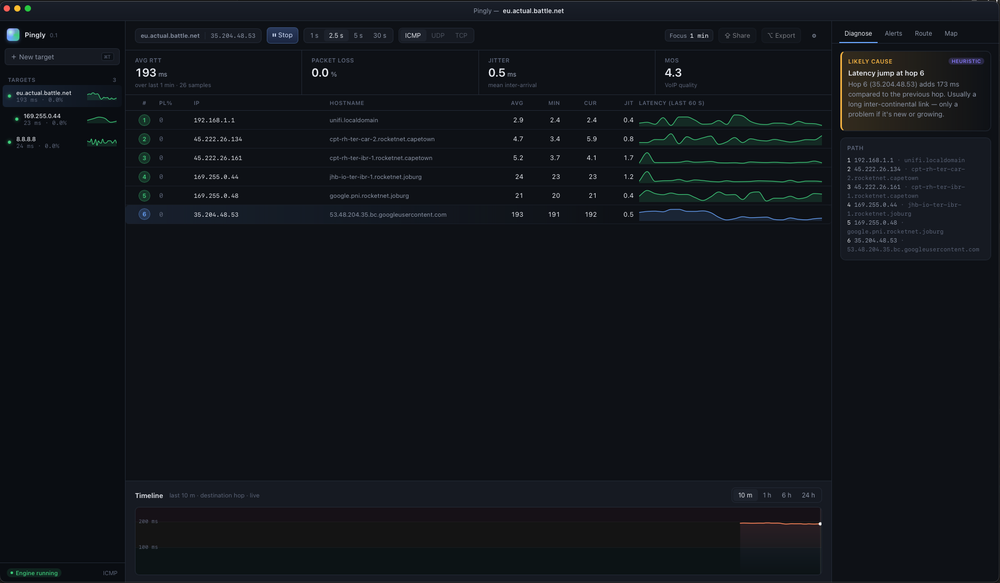
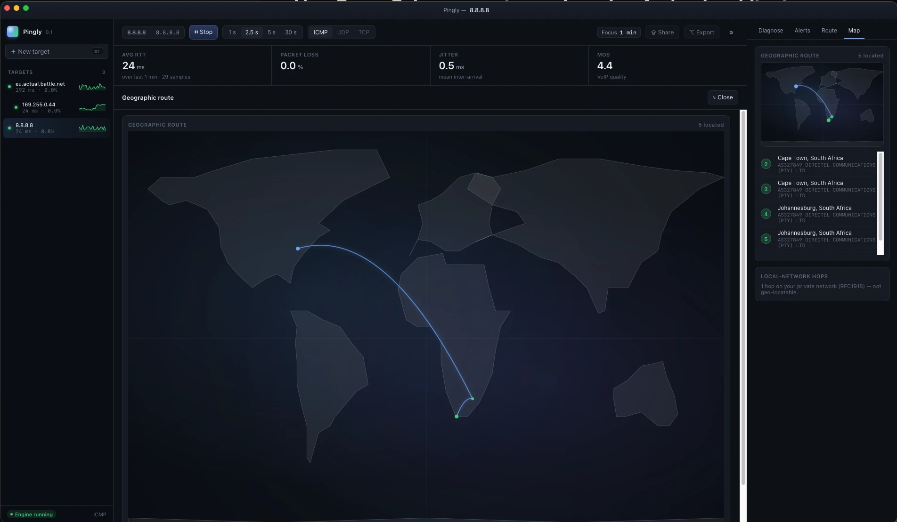
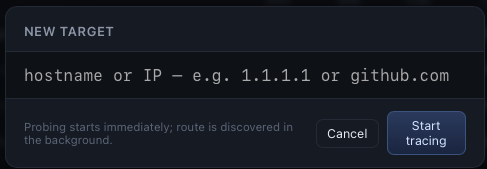

# Pingly

A fast, modern visual network path analyser. Pingly traces every hop between
you and a destination, then keeps pinging each hop continuously so you can
see *where* and *when* the path degrades.

Native desktop app for **macOS**, **Linux**, and **Windows**. Single binary,
single window, small footprint.

→ **[Download the latest release](https://github.com/LFBernardo/pingly-releases/releases/latest)**

---

## Features

- **Continuous per-hop probing** — traceroute the destination, then keep
  pinging every hop on a chosen interval (1 s / 2.5 s / 5 s / 30 s)
- **Multi-target sidebar** with live sparklines per target
- **Hop table** with packet-loss %, average / minimum / current RTT, jitter,
  and a 60-second sparkline for every hop
- **Destination timeline** — smooth monotone-cubic chart that still
  preserves sharp loss spikes so you can spot them at a glance
- **Sub-targets** — double-click any intermediate hop to spin it up as its
  own nested target in the sidebar
- **Geographic route map** — see where your traffic physically travels;
  click to expand to a full-window view
- **Reverse DNS** for every hop, resolved asynchronously
- **Alert engine** — five condition types (loss %, RTT average, jitter,
  target down, route changed) × three actions (desktop notification,
  webhook, log file), with per-rule cooldowns
- **Native desktop notifications** plus Slack / Discord-compatible webhook
  bodies with `{rule_name}`, `{target_id}`, `{message}`, `{value}` templates
- **Local persistence** — targets, hops, and samples are stored locally and
  restored on restart; configurable retention (default 30 days)
- **Headless CLI** (`pingly-probe`) for scripting and smoke-testing,
  including an NDJSON output mode for `jq` pipelines

## Screenshots

**Main window** — multi-target sidebar, hop table with per-hop sparklines, and the heuristic diagnose panel pointing at the slowest link.



**Geographic route** — click the map preview to expand it into the centre panel and see where your traffic physically travels.



**New target** — ⌘T (or Ctrl+T) opens the new-target dialog. Probing starts immediately; the route is discovered in the background.



## Download

Grab the latest installer for your platform from the
**[Releases page](https://github.com/LFBernardo/pingly-releases/releases/latest)**:

| Platform | File | Notes |
| --- | --- | --- |
| 🍎 macOS (Apple Silicon) | `Pingly_*_aarch64.dmg` | macOS 14+ |
| 🐧 Linux (Debian / Ubuntu) | `Pingly_*_amd64.deb` | x64; grants `cap_net_raw` on install |
| 🐧 Linux (portable) | `Pingly_*_amd64.AppImage` | x64; run `chmod +x` first |
| 🪟 Windows 11 (installer) | `Pingly_*_x64_en-US.msi` | x64 |
| 🪟 Windows 11 (standalone) | `pingly.exe` | x64; no installer, just run |
| 🪟 Windows 11 (diagnostic) | `pingly-debug.exe` | x64; console build for troubleshooting |

## Install

### macOS

1. Download `Pingly_*_aarch64.dmg`
2. Open the `.dmg` and drag **Pingly** into Applications
3. First launch: right-click the app → **Open** (the build is not yet
   notarised, so Gatekeeper needs the explicit consent)

### Linux (Debian / Ubuntu)

```sh
sudo dpkg -i Pingly_*_amd64.deb
sudo apt-get install -f   # pulls any missing runtime libs
```

The post-install step grants the binary the `cap_net_raw` capability so it
can open ICMP sockets without `sudo`.

### Linux (portable AppImage)

```sh
chmod +x Pingly_*_amd64.AppImage
./Pingly_*_amd64.AppImage
```

You may need `sudo setcap cap_net_raw+ep ./Pingly_*_amd64.AppImage` if
ICMP socket creation fails.

### Windows 11

- **Installer route:** double-click `Pingly_*_x64_en-US.msi`
- **Standalone route:** download `pingly.exe` and run it directly — no
  install required
- If raw ICMP fails, launch from an Administrator command prompt or use
  `pingly-debug.exe`, which keeps a console window open for diagnostics

## Requirements

- macOS 14 (Sonoma) or newer, Apple Silicon
- Ubuntu 22.04 / Debian 12 or newer (x64)
- Windows 11 (x64)

## Releases

- **[Latest release](https://github.com/LFBernardo/pingly-releases/releases/latest)**
- **[All releases](https://github.com/LFBernardo/pingly-releases/releases)**
- **[Changelog](CHANGELOG.md)**

## About

Pingly is built natively for the desktop with a Rust core and a webview
front-end. The whole app is one small binary — no Electron, no background
agent, no telemetry.

Pingly is proprietary software. Pre-built binaries are distributed for free
under the licence terms shipped inside each release.

---

© 2026 Louis Bernardo. All rights reserved.
